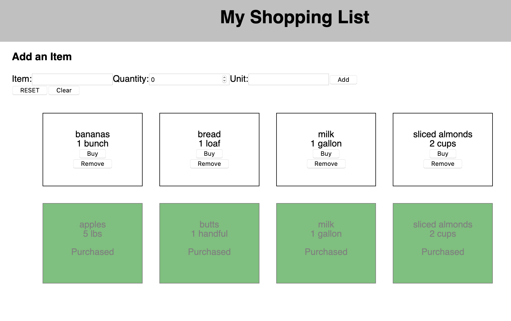

# React Shopping List

## Description 

React Shopping List is a project built over two days by four students at Prime Academy. This project is a group assignment from the template [Prime Academy](https://github.com/PrimeAcademy/group-fs-react-shopping-list)

The shopping list is an e-commerce full-stack application built with React frontend and a Node backend.

## Screen Shots

### 1st Phase

### 2nd Phase

## Prerequisites 
[Node.js](https://nodejs.org/en/)  
[NPM](https://www.npmjs.com/)  
[Postico](https://eggerapps.at/postico/)  
[React](https://reactjs.org/)  

## Installation 
1. Create the database named "fs-react-shopping" in Postico. Afterwards, the user can open the database.sql file and copy/paste the text in Postico to create the tables and dummy data.  
2. Open up the text editor of your choice and within the terminal, run npm install. NPM will install all the necessary components assuming you have React installed. 
3. Use the command 'npm run client' in your terminal
4. Use the command 'npm run server' in another terminal
5. A browser window will automatically pop up with the application running

## Usage 

1. First, the user should notice the UI (user interface). On the UI, the user will see the auto-populated dummy data. From this screen, the user can input data into the from which will enter new items into the shopping list. 
2. Once a new item is created, the user can select a BUY or REMOVE button for the new item. The BUY button will indicate to the server the item is now bought to remove the BUY or REMOVE buttons from the item. 
3. If the user clicks the REMOVE button, the item will be removed from the server and the list of items will be updated on the DOM. 
4. If the user clicks the CLEAR button, all items will be removed from the server and the DOM will update. 

## Built With 

1. Express  
2. HTML/CSS  
3. Javascript  
4. Node  
5. PostgreSQL & Postico  
6. React  
7. VS Code (Text Editor)  

## Acknowledgements 

Special thanks to Prime Academy and Cullen Pod-2, John Shands, Dusty Meyers, John Anthony, and Patrick Nelson! 

